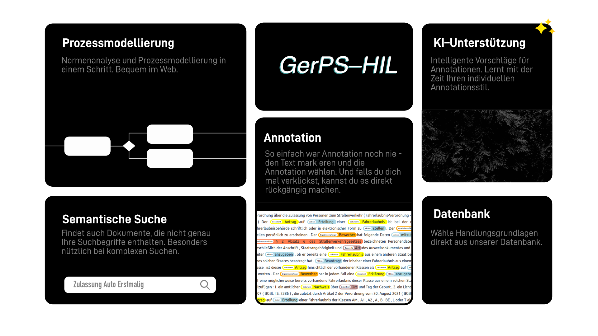

# HIL Prototype

For more information, check out the following resources:
- GovTech / openDVA Poster about this tool
- Systems Demonstration Paper Draft (in ./publication)

#### Tech Stack
- REST Web Application
- **Frontend**: SvelteKit, Bootstrap, bpmn.io
- **Backend**:  Docker, Python (Flask), RabbitMQ, Flair, Elastic, pytesseract

For more notes, presentations, guidelines etc. concerning this project see [./resources](./resources/).

There is also a dedicated section for the documentation of this tool in the [Git Pages](https://fusion.gitpages.uni-jena.de/project/ozg/04_ergebnisse/00-canareno/Meilenstein_2/Forschungsergebnisse/Tool_intelligent_normanalysis)

## Usage

Das GerPS-HIL Tool

Das Tool wurde für die Normenanalyse und Prozessmodellierung gebaut. Ziel des Tools ist es die Erstellung von Prozessen aus Handlungsgrundlagen zu vereinfachen, indem eine einfache, intuitive Benutzeroberfläche mit KI-Techniken kombiniert wird.

Nutzer durchlaufen grundsätzlich die folgenden 3 Schritte. 
Es kann jederzeit zu einem vorherigen Schritt zurückgekehrt werden.
Dabei geht jedoch der bisherige Fortschritt in allen nachfolgenden Schritten verloren.

> Tritt ein Fehler auf, empfehlen wir die Website zu aktualisieren (Taste F5 oder Refresh-Icon in der Adresszeile).
> Hilft das nicht, bitten wir Sie uns zu kontaktieren.

1. **Handlungsgrundlagen auswählen**

- Zunächst werden die vom Nutzer identifizierten Handlungsgrundlagen ausgewählt und in das Programm geladen. Das Tool stellt grundsätzlich 2 Möglichkeiten bereit, relevante Handlungsgrundlagen zu öffnen.
    - Einerseits kann der Nutzer die Suche nutzen, um in unserer Datenbank nach Handlungsgrundlagen zu suchen. Dabei stehen zwei verschiedene Suchmodi zu verfügung. Bei der einfachen/normalen Suche, wird der Text in der Suchbox mit dem Text der Dokumente in der Datenbank abgeglichen. Die semantische Suche geht darüber hinaus, und gleicht nicht nur den einfach Text, sondern auch dessen Bedeutung, mit den Dokumenten in der Datenbank ab. Das Nutzen der semantische Suche empfehlen wir erst bei Suchtexten die aus mehr als 2 Begriffen bestehen.
    - Andererseits kann der Nutzer lokal schon vorhandene Dateien hochladen. Das ist als .PDF Dokument oder als .TXT Dokument möglich. Es können mehrere Dokumente zeitgleich hochgeladen werden. Die hochgeladenen Dokumente werden dann vom unserem System verarbeitet, um möglichst nützliche Vorschläge zu machen.
- Der Text der aus den PDFs extrahiert wird kann Störelemente beinhalten, besonders wenn das PDF Tabellen, Diagramme oder Bilder enthält. Auch Footer und Header des PDFs können im extrahierten Text auftauchen. Bitte lassen Sie sich davon nicht irritieren, wir arbeiten an einer Lösung.

2. **Annotation**
- Nachdem unser System die Dokumente verarbeitet hat, wird der Nutzer auf die nächste Seite weitergeleitet. Dort werden die hochgeladenen Dokumente präsentiert. Falls mehrere Dokumente hochgeladen wurden, kann der Nutzer zwischen den Dokumenten blättern. Die Ansicht zeigt die Dokumente mit farbigen Markierungen, bei denen es sich um Vorschläge unseres Systems handelt, um was es sich bei den markierten Textstellen handeln könnte (z.B. eine Handlungsgrundlage, oder ein Datenfeld). Diese Markierungen dienen später bei der Prozesserstellung der Orientierung.
- Nutzer sind dazu angehalten die vorgeschlagenen Annotationen so anzupassen, wie es Ihnen später bei der Prozesserstellung am ehesten hilfreich sein wird. In dem Schritt der Prozesserstellung wird der markierte Text weiterhin sichtbar sein.
- Ist der Nutzer mit dem annotierten Text zufrieden, kann er mit dem “Confirm” Button zum nächsten Schritt weitergehen.
- _Annotationen anpassen_:
    - hier erklären, wie der Nutzer annotationen hinzufügen, entfernen, modifizieren kann
- _Annotation History_:
    - hier erklären, wie er Schritte rückgängig machen kann
- Änderungen die in diesem Schritt vorgenommen wurden, werden alle 30 Sekunden automatisch gespeichert und bei direktem erneuten Aufruf dieses Prozessschritts wiederhergestellt.

3. **Prozessmodellierung**
- In dem letzten und arbeitsaufwändigsten Schritt ist nun das Ziel ein Prozessdiagram zu erstellen. Dafür stehen 3 Ansichten zur Verfügung. Zwischen diesen kann vom Nutzer nach belieben gewechselt werden.
    - Text-Ansicht: 
        - In dieser Ansicht kann der Nutzer sich die Handlungsgrundlagen erneut durchlesen.
    - BPMN-Ansicht:
        - In dieser Ansicht kann der Nutzer den Prozess modellieren.
    - Kombinierte Ansicht: 
        - In dieser Ansicht kann der Nutzer den Prozess modellieren, und hat gleichzeitig die Möglichkeit den annotierten Text zu referenzieren (anzusehen).
- Die Hauptkomponente dieses Schritts ist der Prozessmodellierer. Darin wird von unserem System zunächst eine Vorlage angelegt, die auf grundlegenden Informationen basiert, die dem annotierten Text entnommen wurden (z.B: Name des Hauptakteurs). Die Modellierung von BPMN Prozessen erfolgt hier horizontal, nicht vertikal. Es sind nicht alle FIM Prozessmodellierungsbausteine verfügbar (z.B. keine Referenzaktivitätengruppen). Elemente können nach platzieren bearbeitet werden, indem, nach Auswahl des zu bearbeitended Elements, auf das kleine Werkzeug-Symbol geklickt wird.
- Das fertig modellierte BPMN Diagram kann durch einen Klick auf den Download-Button heruntergeladen werden.
- Änderungen die in diesem Schritt vorgenommen wurden, werden alle 30 Sekunden automatisch gespeichert und bei direktem erneuten Aufruf dieses Prozessschritts wiederhergestellt.

## Development

Information for developers who intend to work on this project. The project consists of two main parts, the frontend and the backend.
During developemnt, we recommed running the back-end and front-end independently. This way live-reload works with svelte, making development much easier.

- Clone this repository
- optional: change credentials in the `.development.env`
- put trained model into the `.shared/base-models` folder`
    - expected folder name per default is `bilstm-crf`, so it looks like this in the end: `shared/base-models/bilstm-crf/final-model.pt` (the other content of the zip is also required)
    - download trained bilstm-crf model from here: 
    - optional: also download the trained xmlr model from link above (zenodo), put in `shared/base-models/xlm-roberta-large/final-model.pt`
- optional: put model for semantic search in base-folder
    - clone [this](https://huggingface.co/sentence-transformers/distiluse-base-multilingual-cased-v1/) repo with git lfs
    - it should look like this in the end: `shared/base-model/distiluse...cased-v1/pytorch_model.bin` (the other content of the zip/repo is also required) 
    - [troubleshooting: git-lfs-is-not-a-git-command-unclear](https://stackoverflow.com/questions/48734119/git-lfs-is-not-a-git-command-unclear)
    - download legal norms: cd backend, `python tool_crawler.py`
    - create vectorized norms for semantic search from backend folder: `python server-container/handlers/database/wordembedding.py`
    - index both legal norms and vectorized norms: `python server-container/handlers/database/esearch.py` 
- Run `sudo docker compose up --build` in the `backend` folder to re-build the docker images and start the containers.
- Some fairly recent version of node is required (v23.2.0 works). I recommend using `nvm`. For installation see [here](https://nodejs.org/en/download/package-manager)
- Run `npm i` in the `frontend` folder to install the required node packages.
- Run `npm run dev` in the `frontend` folder to run the svelte project. Check the output to see what port it is available on.
- For information about the frontend, see [./frontend/README.md](./frontend/README.md).
- For information about the backend, see [./backend/README.md](./backend/README.md)

## Deployment

The project is configured to automatically use different settings in the production environment (e.g. via the .env.production).
The project is currently configured to run on the domain: [http://127.0.0.1/](http://127.0.0.1/)

For deployment, perform the following steps:
- clone the repository
- default admin password should be changed (in [`.development.env`](./backend/.development.env) file (or [`config.py`](./backend/shared/config.py)))
- flask jwt secret should be changed (in [`.development.env.`](./backend/.development.dev) file or [`config.py`](./backend/shared/config.py))
- add pre-trained BILSTM model to the [`.shared/base-models`](./backend/shared/base-models) folder
- add pre-trained XLM-RoBERTa model to the [`.shared/base-models`](./backend/shared/base-models) folder
- if desired: enable GPU support, see [`./backend/README.md`](./backend/README.md)
- run `sudo docker compose up` and watch the logs, test functionality by accessing http://127.0.0.1/ .
- use `-d` flag to run in background, or `sudo docker compose stop` or `sudo docker compose restart` for managing

### Production Architecture
The production system consists of some additional components, compared to the development one.

#### Svelte
While during development, the backend and frontend are run separately, they are combined into **one single docker-compose for production**.
Consequently there exists a dockerfile (`./frontend/Dockerfile`) for the frontend, which builds (and runs) the release-version of the svelte project. 

#### Traefik
In addition, there is another additional service included in the docker-compose. Thre traefik reverse proxy is necessary, so that we can "join" all the services that our project provides under the umbrella of one single domain and port. This is common practice with web-servers and api-servers. In our case, all requests go to the svelte-container, except for the ones for URLs starting with `/api`. This is the main purpose of the traefik service. In treafiks configuration file, the dashboard can be disabled or enabled. For monitoring purposes, logging is enabled.
Might have password-protection enabled for the dashboard, in that case use `admin:somepassword2024`. The traefik dashbboard can be accessed on port `8080` if enabled.

### Monitoring and Security
With all services exposed to the public, it is important that they are monitored. Even though all services are being run in containers, there are techniques with which attackers may escape the containers to get control of the host machine. Acknowledging that we are building a tool as a prototype, with limited time and resources, we cannot be sure that there are no security issues with out application.
To notice unusual behaviour and respond to it, traefik logs (for the web traffic analysis) and docker logs (for resource usage analysis) are being collected and displayed. For this purpose another docker-compose was set up and should be run while the project is deployed.

#### Prometheus
[Website](https://prometheus.io/). Collects the logs from cAdvisor and Traefik. Grafana displays the data collected by Prometheus.
Also has a very minimal web-ui exposed on port `9090` where one can check if data collection is working (has to be port-forwarded via SSH).
Uses HTTP requests to collect information from cAdvisor and Traefik endpoints.

#### cAdvisor
[Website](https://github.com/google/cadvisor). Collects information about docker container system resource usage (RAM, CPU, DISK, IO etc). 
Also has a very minimal web-ui exposed on some port `8040`(has to be port-forwarded via SSH).

#### Grafana
Collects information from Prometheus, with the purpose of visualizing the data in dashboards.
This is our main way of monitoring the web application + backend and its usage.
In case this is set up from scratch, some additional configuration has to be done (add data sources, add dashboards).
It exposes a Web-UI on port `3001` (locally), so this has to be port-forwarded via SSH to the local machine to be able to view it (see commands below).
The Web-UI is protected with credentials that I set to `admin:somepassword2024`, but can be changed at any time.`
There are two dashboards, one for the system resources and one for the web requests arriving at the server.    
- Using the official traefik dashboard
- Using [this](https://grafana.com/grafana/dashboards/15798-docker-monitoring/) dashboard for the cAdvisor data

